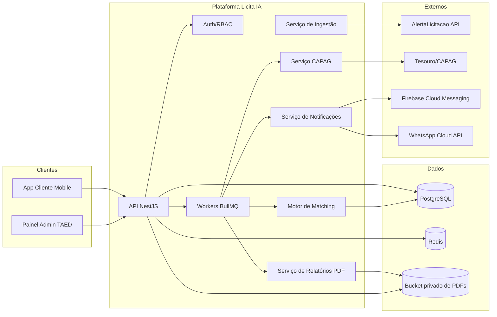
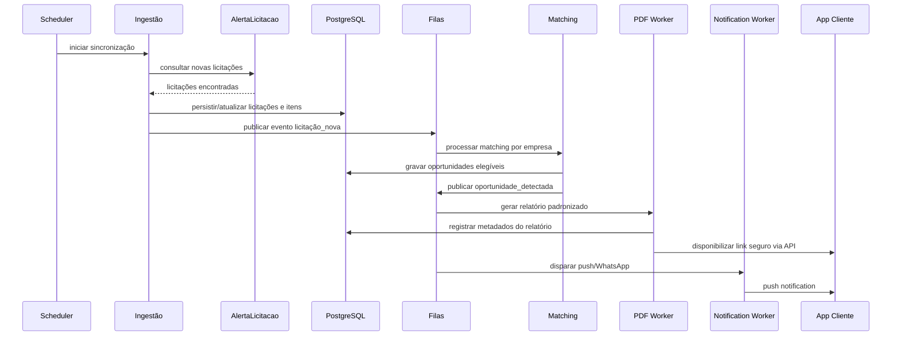
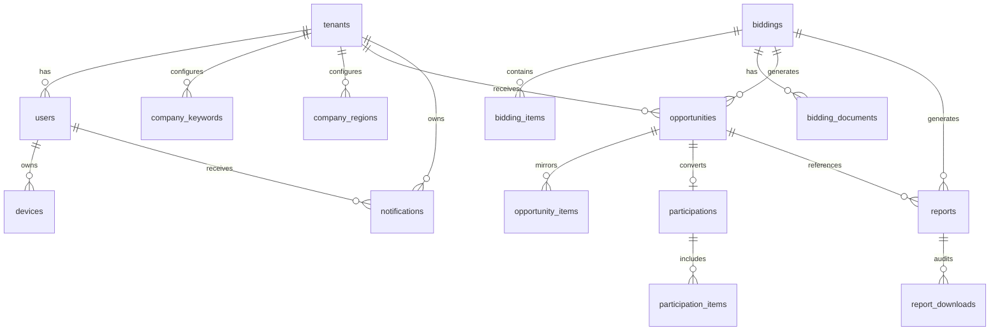

# Arquitetura do Sistema Licita IA

## Objetivo

Definir a arquitetura completa do **Licita IA**, um SaaS de gestão de licitações públicas brasileiras para a **TAED Soluções**, cobrindo:

- app cliente mobile
- app admin para operação interna da TAED
- backend API multi-tenant
- robô de relatórios PDF
- integração CAPAG
- integrações externas de captação e notificação
- modelo de dados
- API REST
- plano faseado de implementação
- riscos e validações

## Decisões críticas validadas

### Stack recomendada

- **Mobile cliente + admin**: **React Native com Expo**
- **Backend API**: **Node.js + NestJS + TypeScript**
- **Banco principal**: **PostgreSQL**
- **Cache e filas**: **Redis + BullMQ**
- **Storage de PDFs**: **S3 compatível**
- **Push mobile**: **Firebase Cloud Messaging (FCM)**
- **WhatsApp**: **WhatsApp Business Cloud API (Meta)**
- **Observabilidade**: **OpenTelemetry + logs JSON + métricas Prometheus/Grafana**

### Justificativas

#### React Native em vez de Flutter

- favorece **stack unificada em TypeScript** entre mobile, backend, SDKs e contratos de API
- reduz custo operacional da equipe e facilita monorepo compartilhado
- acelera entrega do app cliente e de um futuro app/admin web com reaproveitamento de componentes
- é suficiente para o padrão visual do produto, que é predominantemente orientado a listas, cards, filtros e formulários

**Alternativa rejeitada: Flutter**
- melhor performance bruta de UI, porém adiciona **Dart** à operação e reduz compartilhamento direto de tipos com o backend
- custo de equipe e manutenção tende a ser maior no contexto do produto atual

#### NestJS/Node.js em vez de Python/FastAPI como core

- o núcleo do sistema é **integração, CRUD, matching, notificações e orquestração assíncrona**, cenário em que Node.js performa muito bem
- **TypeScript end-to-end** reduz divergência de contratos
- NestJS oferece arquitetura modular, guardas, interceptors, OpenAPI, autenticação e filas com boa padronização
- permite, se necessário, **microserviço Python futuro** apenas para enriquecimento de IA/NLP sem contaminar o core transacional

**Alternativa rejeitada: Python/FastAPI como core principal**
- excelente para IA/NLP, mas adiciona complexidade desnecessária ao coração transacional do sistema neste estágio
- vantagem de IA pode ser capturada depois em serviço especializado sem comprometer o core

#### PostgreSQL em vez de banco NoSQL principal

- domínio é altamente relacional: empresas, usuários, preferências, licitações, itens, participações, notificações, CAPAG, relatórios e auditoria
- suporte forte a **JSONB**, **full-text search**, índices compostos, particionamento e **RLS**
- facilita consistência, rastreabilidade e relatórios operacionais

**Alternativa rejeitada: NoSQL como principal**
- pior aderência ao modelo transacional multi-tenant com muitas relações e regras de negócio

## Visão arquitetural

### Estilo

Arquitetura **modular monolítica orientada a domínio**, com **processamento assíncrono por filas**.

Essa abordagem entrega:

- menor complexidade operacional no início
- boundaries claros para futura extração de serviços
- alta produtividade para MVP
- boa escalabilidade para workloads assíncronos

### Domínios principais

1. **Identidade e acesso**
2. **Empresas clientes e preferências**
3. **Captação de licitações**
4. **Matching de oportunidades**
5. **Participação e proposta consolidada**
6. **Relatórios PDF**
7. **Notificações**
8. **CAPAG e risco financeiro**
9. **Auditoria e observabilidade**

## Diagrama de componentes

## Fluxo de dados principal

## Arquitetura funcional por módulo

### 1) App Cliente

#### Funcionalidades

- login por email/senha
- dashboard de oportunidades com cards
- filtros por status, região, faixa de valor e data
- badge de análise completa
- ações **Participar** e **Declinar**
- detalhe da licitação com itens
- preenchimento de **marca** e **valor final com lucro por item**
- envio de **proposta consolidada**
- download de relatório PDF
- visualização de **CAPAG** com explicação simplificada
- recebimento de notificações push

#### Camadas

- UI/screens
- state/query cache
- services/API client
- autenticação segura
- notificações push
- armazenamento local mínimo para sessão

### 2) App Admin TAED

#### Funcionalidades

- cadastro e gestão de empresas clientes
- cadastro de usuários por empresa
- palavras-chave de materiais/serviços por empresa
- regiões de interesse por empresa
- painel de oportunidades aceitas
- visão da proposta enviada pelo empresário
- dashboard de participações
- acompanhamento operacional da equipe TAED

### 3) Backend API

#### Módulos internos

- **AuthModule**
- **UsersModule**
- **CompaniesModule**
- **PreferencesModule**
- **BiddingsModule**
- **MatchingModule**
- **ParticipationModule**
- **ReportsModule**
- **NotificationsModule**
- **CapagModule**
- **AdminModule**
- **AuditModule**
- **IntegrationModule**

### 4) Bot de Relatórios

#### Função

Gerar automaticamente o PDF padronizado da TAED a partir de dados estruturados da licitação e regras de risco.

#### Estratégia

- template HTML padronizado por seção
- renderização server-side para PDF
- armazenamento privado em bucket
- download via URL assinada temporária
- trilha de auditoria por geração e download

### 5) Integração CAPAG

#### Estratégia

- sincronização periódica dos dados oficiais do Tesouro
- normalização por município/UF/código IBGE
- classificação exibida como **A/B/C/ND**
- resumo explicativo derivado da nota
- cache em Redis e persistência em PostgreSQL

## Modelo de dados completo

### Convenções

- todas as tabelas transacionais multi-tenant possuem `tenant_id`
- chaves primárias: UUID
- timestamps: `created_at`, `updated_at`
- soft delete onde fizer sentido operacional
- auditoria para operações sensíveis

### Tabelas principais

#### `tenants`

Empresa cliente da TAED.

Campos:
- id
- corporate_name
- trade_name
- cnpj
- status
- contact_name
- contact_email
- contact_phone
- whatsapp_number
- plan_type
- lgpd_consent_at
- created_at
- updated_at

#### `users`

Usuários autenticados.

Campos:
- id
- tenant_id
- role (`tenant_owner`, `tenant_user`, `taed_admin`, `taed_operator`)
- full_name
- email
- password_hash
- phone
- is_active
- last_login_at
- created_at
- updated_at

#### `devices`

Dispositivos móveis para push.

Campos:
- id
- user_id
- platform
- fcm_token
- app_version
- last_seen_at
- created_at
- updated_at

#### `company_keywords`

Palavras-chave configuradas por empresa.

Campos:
- id
- tenant_id
- keyword
- normalized_keyword
- match_type (`include`, `exclude`)
- weight
- created_at
- updated_at

#### `company_regions`

Regiões de interesse por empresa.

Campos:
- id
- tenant_id
- uf
- municipality_name
- municipality_ibge_code
- scope_type (`uf`, `municipio`, `nacional`)
- created_at
- updated_at

#### `biddings`

Licitações ingeridas da fonte externa.

Campos:
- id
- source (`alertalicitacao`)
- source_external_id
- source_url
- bidding_number
- modality
- uasg
- sphere
- agency_name
- agency_document
- object_text
- object_summary
- publication_date
- opening_date
- proposal_due_date
- estimated_value
- municipality_name
- municipality_ibge_code
- uf
- status (`open`, `closed`, `suspended`, `cancelled`)
- risk_level (`low`, `medium`, `high`)
- raw_payload JSONB
- content_tsvector
- created_at
- updated_at

#### `bidding_items`

Itens da licitação.

Campos:
- id
- bidding_id
- item_number
- description
- quantity
- unit
- unit_value_estimated
- total_value_estimated
- catalog_code
- raw_payload JSONB
- created_at
- updated_at

#### `bidding_documents`

Anexos e documentos associados.

Campos:
- id
- bidding_id
- document_type
- file_name
- source_url
- checksum
- created_at
- updated_at

#### `capag_records`

CAPAG atual por município.

Campos:
- id
- municipality_ibge_code
- municipality_name
- uf
- capag_rating (`A`, `B`, `C`, `ND`)
- explanation_short
- reference_year
- source_reference
- raw_payload JSONB
- updated_from_source_at
- created_at
- updated_at

#### `capag_history`

Histórico de CAPAG por referência.

Campos:
- id
- municipality_ibge_code
- capag_rating
- explanation_short
- reference_year
- raw_payload JSONB
- created_at

#### `opportunities`

Resultado do matching por empresa.

Campos:
- id
- tenant_id
- bidding_id
- matching_score
- matched_keywords JSONB
- matched_region_type
- capag_rating_snapshot
- status (`new`, `viewed`, `accepted`, `declined`, `expired`)
- analysis_completed_at
- first_notified_at
- created_at
- updated_at

#### `opportunity_items`

Espelho dos itens relevantes no contexto da empresa.

Campos:
- id
- opportunity_id
- bidding_item_id
- suggested_brand
- estimated_margin_percent
- customer_brand
- customer_unit_price
- customer_total_price
- customer_notes
- created_at
- updated_at

#### `participations`

Aceite formal da empresa em participar.

Campos:
- id
- tenant_id
- opportunity_id
- accepted_by_user_id
- status (`draft`, `submitted_to_taed`, `under_review`, `completed`, `cancelled`)
- consolidated_total_value
- submitted_at
- taed_notified_at
- created_at
- updated_at

#### `participation_items`

Itens da proposta consolidada.

Campos:
- id
- participation_id
- bidding_item_id
- brand
- final_unit_price
- quantity
- final_total_price
- margin_value
- margin_percent
- created_at
- updated_at

#### `reports`

Metadados de relatórios PDF.

Campos:
- id
- tenant_id
- bidding_id
- opportunity_id
- report_type (`bidding_analysis`)
- status (`queued`, `processing`, `ready`, `failed`)
- storage_key
- file_name
- checksum
- generated_at
- expires_at
- created_by_system boolean
- created_at
- updated_at

#### `report_downloads`

Auditoria de downloads de PDF.

Campos:
- id
- report_id
- user_id
- downloaded_at
- ip_address
- user_agent

#### `notifications`

Registro de notificações emitidas.

Campos:
- id
- tenant_id
- user_id
- opportunity_id
- channel (`push`, `whatsapp`, `email`)
- template_code
- payload JSONB
- provider_message_id
- status (`queued`, `sent`, `delivered`, `failed`, `read`)
- sent_at
- delivered_at
- failed_reason
- created_at
- updated_at

#### `notification_preferences`

Preferências de recebimento por usuário/empresa.

Campos:
- id
- tenant_id
- user_id nullable
- allow_push
- allow_whatsapp
- quiet_hours_start
- quiet_hours_end
- created_at
- updated_at

#### `integration_sync_runs`

Controle de sincronização das integrações.

Campos:
- id
- integration_name
- run_type
- started_at
- finished_at
- status
- cursor_reference
- records_read
- records_created
- records_updated
- error_summary

#### `audit_logs`

Trilha de auditoria.

Campos:
- id
- tenant_id nullable
- actor_user_id nullable
- action
- resource_type
- resource_id
- metadata JSONB
- created_at

### Relacionamentos

### Índices recomendados

- `biddings(source, source_external_id)` único
- `biddings(status, proposal_due_date)`
- `biddings(municipality_ibge_code, uf)`
- `GIN(content_tsvector)`
- `company_keywords(tenant_id, normalized_keyword)`
- `company_regions(tenant_id, uf, municipality_ibge_code)`
- `opportunities(tenant_id, status, created_at)`
- `participations(tenant_id, status, submitted_at)`
- `notifications(tenant_id, channel, status)`
- `capag_records(municipality_ibge_code)` único

### Segurança multi-tenant

- `tenant_id` obrigatório nas tabelas de negócio
- **RLS no PostgreSQL** para isolamento por empresa
- TAED admins com políticas administrativas explícitas
- logs de auditoria para leitura/download de relatórios

## Estratégia de integração externa

### AlertaLicitacao API

#### Evidência pública encontrada

- a página `https://alertalicitacao.com.br/!api` está publicamente acessível, porém apresenta **apenas tela de acesso/login**, sem documentação técnica pública navegável
- foi encontrada referência pública aos **Termos de Uso da API** em `https://alertalicitacao.com.br/contrato/TermosAPIAlertaLicitacao.pdf`
- os termos indicam que existe uma API comercial, porém **não expõem publicamente endpoints, autenticação, schemas, paginação ou exemplos de payload**

#### Conclusão arquitetural

A integração deve ser tratada como **integração comercial/documentação restrita**. Portanto, o sistema deve nascer com um **adapter de fonte de licitações**, desacoplado do restante da plataforma.

#### Adapter proposto

Interface lógica:
- `fetchBiddings(cursor, filters)`
- `fetchBiddingDetails(externalId)`
- `fetchBiddingItems(externalId)`
- `fetchDocuments(externalId)`
- `healthCheck()`

#### Estratégia operacional

- implementar `AlertaLicitacaoProvider` atrás de uma interface `BiddingSourceProvider`
- persistir payload bruto em `raw_payload`
- versionar mapeamentos de campos por fonte
- criar fallback estrutural para fontes públicas futuras, como **PNCP** e **Compras.gov.br**, caso a documentação/credenciais do AlertaLicitacao não sejam suficientes

#### Mapeamento documentado do estado atual

| Item | Situação atual |
|---|---|
| URL principal | `https://alertalicitacao.com.br/!api` |
| Tipo de acesso observado | tela de login |
| Endpoints públicos documentados | não encontrados publicamente |
| Autenticação pública documentada | não encontrada publicamente |
| Paginação | não documentada publicamente |
| Limites/rate limit | não documentados publicamente |
| Schemas/respostas | não documentados publicamente |
| Termos de uso | PDF público encontrado |
| Ação recomendada | homologar acesso com fornecedor antes da implementação da integração produtiva |

### CAPAG Tesouro Nacional

#### Dados de negócio

- CAPAG avalia a saúde fiscal de estados e municípios
- classificação usada no produto: **A, B, C, ND**
- a informação deve ser mostrada como apoio à decisão de risco financeiro do órgão pagador

#### Estratégia de integração

- job periódico de ingestão da fonte oficial do Tesouro
- normalização por código IBGE
- persistência histórica para auditoria e referência temporal
- cache para leitura rápida no app
- no card da licitação: exibir nota e explicação simplificada

#### Regras de exibição sugeridas

- **A**: boa saúde financeira
- **B**: saúde mediana, com possibilidade de atrasos
- **C**: saúde fiscal ruim, maior risco de atraso/inadimplência
- **ND**: sem dado disponível ou não classificável

## Motor de matching

### Regras do MVP

#### Entrada

- palavras-chave positivas por empresa
- palavras-chave excludentes por empresa
- regiões por UF ou município
- modalidade e faixa de valor opcionais

#### Estratégia recomendada

1. indexar `object_text` e descrições de itens com full-text search em português
2. cruzar palavras-chave por tenant
3. aplicar filtros geográficos
4. calcular score ponderado
5. enriquecer oportunidade com CAPAG e valor estimado
6. publicar oportunidade se score >= limiar configurável

#### Score inicial sugerido

- match em objeto principal: peso alto
- match em item: peso médio
- match em município/UF: peso alto
- exclusão por palavra negativa: score zerado
- proximidade semântica: adiada para fase futura

#### Evolução futura

- embeddings semânticos
- ranking inteligente por feedback de aceite/declínio
- recomendação de priorização comercial

## Geração de relatórios PDF

### Estrutura obrigatória

1. **Capa**
   - título
   - órgão
   - valor estimado
   - data
   - nível de risco
2. **Resumo Executivo**
3. **Informações Básicas**
   - UASG
   - órgão
   - esfera
   - vigência
   - município/UF
   - valor
   - número do pregão
   - recomendação
4. **Garantias e Condições de Pagamento**
5. **Habilitação Técnica e Econômica**
6. **Condições Particulares** com nível de risco
7. **Tabela de Itens**
   - nº
   - descrição
   - quantidade
   - unidade
   - valor unitário
   - valor total

### Requisitos de segurança

- PDF marcado como **confidencial TAED Soluções**
- bucket privado
- URL assinada temporária
- log de download
- checksum de arquivo

## Mapeamento de API REST

### Autenticação

- `POST /auth/login`
- `POST /auth/refresh`
- `POST /auth/logout`
- `POST /auth/forgot-password`
- `POST /auth/reset-password`
- `GET /auth/me`

### Usuários e dispositivos

- `GET /users/me`
- `PATCH /users/me`
- `POST /devices`
- `DELETE /devices/{deviceId}`

### Empresas clientes / admin TAED

- `GET /admin/tenants`
- `POST /admin/tenants`
- `GET /admin/tenants/{tenantId}`
- `PATCH /admin/tenants/{tenantId}`
- `POST /admin/tenants/{tenantId}/users`
- `GET /admin/tenants/{tenantId}/users`
- `PATCH /admin/users/{userId}`

### Palavras-chave e regiões

- `GET /admin/tenants/{tenantId}/keywords`
- `POST /admin/tenants/{tenantId}/keywords`
- `PATCH /admin/keywords/{keywordId}`
- `DELETE /admin/keywords/{keywordId}`
- `GET /admin/tenants/{tenantId}/regions`
- `POST /admin/tenants/{tenantId}/regions`
- `DELETE /admin/regions/{regionId}`

### Licitações e oportunidades

- `GET /opportunities`
- `GET /opportunities/{opportunityId}`
- `PATCH /opportunities/{opportunityId}/status`
- `GET /biddings/{biddingId}`
- `GET /biddings/{biddingId}/items`
- `GET /biddings/{biddingId}/documents`

### Participação e proposta

- `POST /opportunities/{opportunityId}/participate`
- `POST /opportunities/{opportunityId}/decline`
- `GET /participations/{participationId}`
- `PUT /participations/{participationId}/items`
- `POST /participations/{participationId}/submit`
- `GET /participations`

### Relatórios

- `POST /reports/biddings/{biddingId}/generate`
- `GET /reports/{reportId}`
- `GET /reports/{reportId}/download-url`
- `GET /opportunities/{opportunityId}/report`

### CAPAG

- `GET /capag/municipalities/{ibgeCode}`
- `GET /capag/uf/{uf}`

### Notificações

- `GET /notifications`
- `PATCH /notifications/{notificationId}/read`
- `GET /notification-preferences`
- `PUT /notification-preferences`

### Dashboard admin TAED

- `GET /admin/dashboard/overview`
- `GET /admin/dashboard/participations`
- `GET /admin/dashboard/opportunities`
- `GET /admin/dashboard/notifications`

### Operação/integrations

- `POST /internal/integrations/alertalicitacao/sync`
- `POST /internal/integrations/capag/sync`
- `GET /internal/jobs/{jobId}`
- `GET /health`
- `GET /ready`

## Segurança, conformidade e governança

### Requisitos

- autenticação por JWT com refresh rotation
- RBAC por papel
- isolamento multi-tenant com RLS
- hash de senha com algoritmo robusto
- criptografia de dados sensíveis em trânsito e repouso
- trilha de auditoria
- proteção LGPD para dados pessoais
- rate limit por usuário/tenant
- segredo das credenciais em cofre/secret manager

### Regras específicas

- PDFs nunca públicos
- links de download expiram rapidamente
- auditoria de aceite/declínio e submissão de proposta
- acesso TAED separado de acesso cliente
- toda integração externa com timeouts, retries e circuit breaker

## Observabilidade e operação

### Logs

- logs estruturados JSON
- `trace_id`, `tenant_id`, `user_id`, `opportunity_id` quando aplicável

### Métricas mínimas

- licitações ingeridas por execução
- oportunidades geradas por tenant
- taxa de aceite/declínio
- tempo de geração de PDF
- taxa de entrega de push
- taxa de entrega de WhatsApp
- falhas por integração externa
- jobs em fila e tempo médio em fila

### Alertas

- falha de sync com AlertaLicitacao
- queda de entrega de push/WhatsApp
- falha de geração de PDF
- atraso de jobs críticos
- aumento anormal de erros 5xx

## Plano faseado de implementação

### Fase 1 — MVP

#### Escopo

- backend base com autenticação e multi-tenancy
- modelagem inicial do banco
- ingestão de licitações por provider
- matching por palavras-chave e região
- app cliente mobile básico
- dashboard de oportunidades
- detalhe da licitação com itens
- ações participar/declinar
- push notification
- CRUD inicial de empresas, usuários, palavras-chave e regiões

#### Entregas

- login/senha
- feed de oportunidades
- detalhe da licitação
- registro de decisão do cliente
- notificação push quando nova oportunidade surgir
- painel mínimo interno para cadastro operacional

#### Critérios de pronto

- empresa consegue entrar, ver oportunidade e decidir participar/declinar
- TAED consegue cadastrar cliente, palavras-chave e regiões
- pipeline de ingestão → matching → notificação funcionando ponta a ponta

### Fase 2 — Admin completo + relatórios

#### Escopo

- painel admin TAED completo
- dashboard de participações
- proposta consolidada por item
- geração automática do PDF padronizado
- download seguro do relatório
- auditoria de downloads
- regras de risco iniciais no relatório

#### Critérios de pronto

- empresário consegue preencher marca e valor por item
- TAED recebe aceite com dados da proposta consolidada
- relatório PDF é gerado automaticamente e baixado com segurança

### Fase 3 — CAPAG + WhatsApp

#### Escopo

- ingestão CAPAG oficial
- enriquecimento de oportunidades com nota e explicação
- notificações via WhatsApp Business
- preferências de canal
- refinamentos de matching e dashboards analíticos

#### Critérios de pronto

- app exibe CAPAG no card e no detalhe
- notificações podem sair por push e WhatsApp
- painel admin mostra desempenho operacional e participações consolidadas

## Estratégia de implementação técnica

### Estrutura de projeto recomendada

- `plan.md`
- `apps/mobile-client`
- `apps/admin-web`
- `apps/api`
- `packages/shared-types`
- `packages/ui`
- `packages/config`

### Sequência de construção

1. fundação do backend e banco
2. autenticação, tenants e RBAC
3. provider de ingestão e persistência de licitações
4. matching e oportunidades
5. app cliente MVP
6. participação/proposta consolidada
7. admin dashboard
8. geração de relatórios
9. CAPAG
10. WhatsApp e refinamentos operacionais

## Riscos principais e mitigação

### 1. Documentação restrita do AlertaLicitacao

**Risco:** integração não pode ser finalizada sem credencial e documentação contratada.

**Mitigação:**
- isolar provider por interface
- homologar credenciais antes da sprint de integração
- prever fallback com fontes públicas se necessário

### 2. Falsos positivos no matching

**Risco:** usuários recebem oportunidades irrelevantes.

**Mitigação:**
- palavras excludentes
- score configurável
- feedback de aceite/declínio para ajuste posterior

### 3. Vazamento de relatório confidencial

**Risco:** PDF circular fora do canal autorizado.

**Mitigação:**
- bucket privado
- URL assinada curta
- auditoria de downloads
- marcação visual de confidencialidade

### 4. Dependência de canais externos de notificação

**Risco:** falhas em FCM ou WhatsApp impactam SLA percebido.

**Mitigação:**
- retries e DLQ
- status de entrega persistido
- prioridade ao push no MVP e WhatsApp em fase controlada

### 5. Crescimento de volume de licitações

**Risco:** degradação no matching e consultas.

**Mitigação:**
- índices corretos
- jobs assíncronos
- particionamento futuro
- abstração do mecanismo de busca para evolução sem ruptura

## Traceabilidade: etapa → alvos → verificação

| Etapa | Alvos principais | Verificação |
|---|---|---|
| Fundação | auth, tenants, banco, RLS | login, isolamento entre tenants, migrations íntegras |
| Ingestão | provider, biddings, items | licitações persistidas sem duplicidade |
| Matching | keywords, regions, opportunities | empresa recebe apenas oportunidades compatíveis |
| Mobile MVP | login, dashboard, detalhe | fluxo entrar → visualizar → participar/declinar |
| Participação | proposal items, submit | TAED visualiza proposta consolidada |
| Relatórios | reports, storage, download | PDF gerado, auditado e baixado com URL temporária |
| CAPAG | sync, cache, display | licitação municipal mostra classificação correta |
| WhatsApp | template, delivery log | envio registrado e rastreável |

## Definição de pronto (DoD)

- arquitetura validada e documentada
- stack definida com justificativa
- schema completo modelado
- endpoints REST mapeados
- integrações externas desenhadas com mitigação de risco
- plano faseado fechado
- `plan.md` definido como documento raiz do projeto
- backlog técnico inicial derivável diretamente deste plano